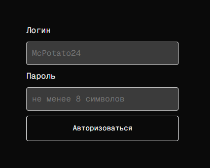
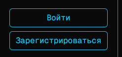
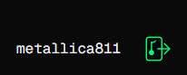

# Auth page

First, a token is generated, then it sends the token, login, and password to the ``postAuthData`` function. If they match, it returns true, and the status in ``handleAuth`` changes to an authorized user. After authorization, the authorization and registration buttons in the bottom left corner change to the login and a logout icon. On the main page, the ability to play music appears.

## Form

## Changing of buttons in bottom left corner

### from

### to
