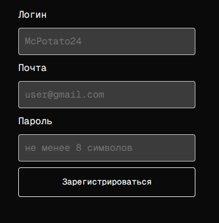

# Registration page

## Description
There are whole logic in ``RegContent``. Get token when use enter on the page from ``useHandleGetToken``, then after inputing details (login, mail, password) send data to server in ``addUser``. If from server get seccess use ``handleReg``.

